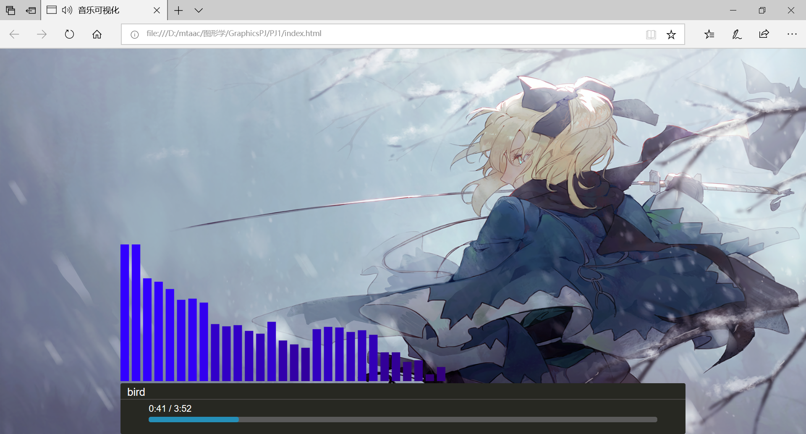

## 图形学PJ1

### 实验环境

PJ1实验基于`javascript`。


### 运行说明

直接打开`index.html`。打开之后将直接播放音乐，并显示对应的音乐可视化动态图景。

**仅适配edge浏览器**，不可用于chrome和IE，下面会说明对应原因。


### 相关原理说明

#### 音乐播放

这部分的内容在`player.js`文件中，核心思想是使用html的`AUDIO`完成音乐播放的工作。

`index.html`中，将new一个`player()`。

```html
<script>
var play = new Player();
    play.config({
        canvasId: "show",
        songTitle: "bird",            
        songSrc: "music/bird.mp3"        
    });
</script>  
```

这个player就会调用load()函数，在html中添加一个`AUDIO`。

```javascript
function load() {
    var audio = document.createElement("AUDIO");
    document.getElementById("player").appendChild(audio);
    Myself.audio = audio;      
    play();
}
```

load()将调用play()函数，播放我们指定的音乐。其中`Myself.songSrc`是在index.html中指定的音乐。在这里指的就是"music/bird.mp3"。因为我们的html是写死的，所以这里就只能播放确定的这一首歌。

此外，chrome浏览器禁用了自动播放功能，所以这里的播放无法执行。可以用过添加一个手动播放的botton来解决，但是从设计的角度来说需要修改UI，所以这里就没做了。

```javascript
function play(){
    Myself.audio.src = Myself.songSrc;
    Myself.audio.play();
    playHandle();    
}
```


#### 音乐可视化

绘图主要通过canvas实现。如play()函数中提到的，音乐播放后，会调用playHandle()函数，进行可视化部分的绘图。

首先生成audioContext进行音频处理。不兼容IE的原因就是这个audioContext，IE好像不支持。

将分析器和音乐的data连接起来，对内容进行分析。

可视化部分被绘制为一个柱状风格的输出。每条的宽度为15，间距为5。

主要核心的部分就是利用canvas去调用`getByteFrequencyData`，获取一个当前的频率数据，存储到数组中。这个数组的大小应当和`analyser.frequencyBinCount`相同（`analyser.frequencyBinCount`的值固定为fftsize的一半）。

获取频率数组后，对数组进行采样。根据设定的柱状图的相关参数，一共有50个bar，则采样step为2.

根据采样获得的结果进行柱状图的绘制。绘制的矩形的颜色根据频率大小该表，矩形的高度就是当前采样的频率值得大小。

```javascript
function playHandle() {
    var audioContext = new (window.AudioContext || window.webkitAudioContext)();
    var analyser = audioContext.createAnalyser();        
    var playData = audioContext.createMediaElementSource(Myself.audio);
    playData.connect(analyser);
    analyser.connect(audioContext.destination);
    analyser.fftSize = 256;
    var canvas = document.getElementById(Myself.canvasId),
        meterWidth = 15, 
        meterNum = 1000 / (15 + 5), 
        ctx = canvas.getContext('2d');
    var drawMeter = function () {
        var array = new Uint8Array(analyser.frequencyBinCount);
        analyser.getByteFrequencyData(array);
        var step = Math.round(array.length / meterNum); 
        ctx.clearRect(0, 0, canvas.width, canvas.height);
        for (var i = 0; i < meterNum; i++) {
            var value = array[i * step];                  
            ctx.fillStyle = 'rgb(50,0,' + (value+100) + ')';
            ctx.fillRect(i * 20, canvas.height - value, meterWidth, value);
        }
        requestAnimationFrame(drawMeter);
    }
    requestAnimationFrame(drawMeter);
}
```


#### 音乐播放时间

这其实是一个附加的功能，光秃秃的可视化页面看起来不太美观，就加了这个时间进度条显示。

时间的显示还是用过audio实现，它可以给出当前音乐的播放时长和总时长。

`readState`表示的是当前的播放状态，4表示正常播放。则获取对应的当前播放时间和总时长。对应计算出百分比，根据百分比绘制进度条的长度。

```javascript
function showTime() {
    if (Myself.audio.readyState == 4) {
        var duration = Myself.audio.duration;
        var currentTime = Myself.audio.currentTime;
        var ratio = ((currentTime / duration) * 100).toFixed(1);
        ratio = ratio == 100.0 ? 100 : ratio;
        function timeFormat(t) {
            return Math.floor(t / 60) + ":" + (t % 60 / 100).toFixed(2).slice(-2);
        }
        document.getElementById("playerProgressBar").style.width = ratio + "%";
        document.getElementById("playerTime").innerHTML = timeFormat(currentTime) + "&nbsp;/&nbsp;" + timeFormat(duration) ;        
    } 
    else {
        document.getElementById("playerTime").innerHTML = "-&nbsp;00:00&nbsp;/&nbsp;00:00&nbsp;";
    }
}
```


### 结果展示




### 参考资料

> https://developer.mozilla.org/zh-CN/docs/Web/API/Web_Audio_API
>
> <https://www.runoob.com/html/html-tutorial.html>

