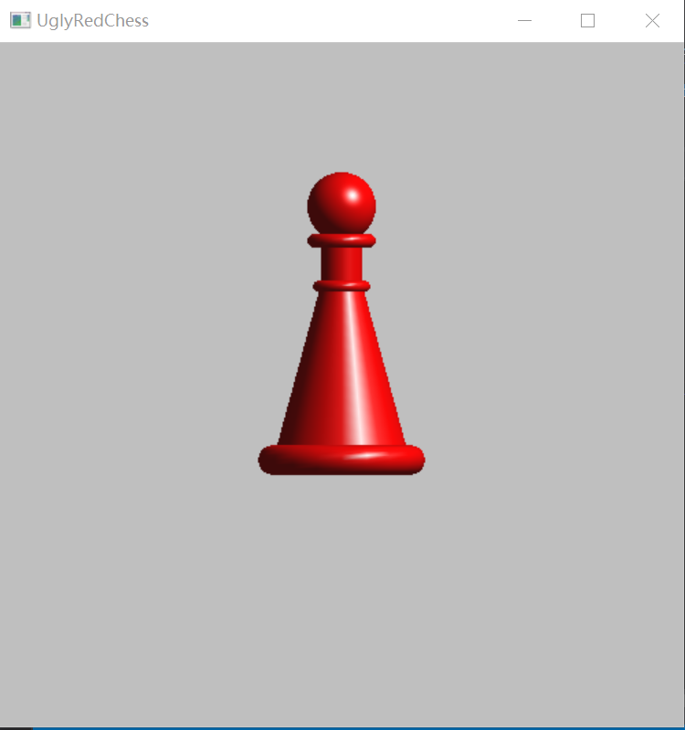

<center><h2>图形学PJ2</h2></center>

### 实验环境

PJ2实验基于`opengl+c`

`opengl`使用`glut`库进行链接，通过`visual studio`编译生成。


### 运行说明

环境比较复杂，上传的可执行文件大概率会因缺少对应链接库而不能运行。


### 相关原理说明

#### opengl初始化

针对opengl的编程和常规的编程过程上有所不同。首先进行初始化，设置窗口的显示模式模式。在这里选择RGB色彩模式，单缓冲，深度缓存。

接着设定串口大小，窗口标题。这样就完成了对窗口的设置。	

```c
glutInit(&argc, argv);
glutInitDisplayMode(GLUT_RGB | GLUT_SINGLE | GLUT_DEPTH);
glutInitWindowSize(500, 500);
glutCreateWindow("UglyRedChess");
```

窗口设置完成后，我们要设定这个窗口的两个函数。

`glutDisplayFunc`指定当窗口内容必须被绘制时，哪个函数将被调用；`glutReshapeFunc`指定当窗口大小改变时，哪个函数将被调用来处理投影等问题。

在完成这两个函数的注册之后，调用`glutMainLoop();`，进入GLUT事件处理循环。

```c
glutDisplayFunc(display);
glutReshapeFunc(reshape);
glutMainLoop();
```


#### display函数

如我们在刚才的描述，display函数是绘图工作的主要部分。在这个函数里，我们将绘制呈现出的3D图形的形状。我在这里绘制的是一个棋子。

首先执行`glClear(GL_COLOR_BUFFER_BIT | GL_DEPTH_BUFFER_BIT);`，它将清除当前缓冲区的指定值。这里清除的是颜色和深度缓冲。

接着开始图形绘制。

```c
glPushMatrix();
glTranslatef(0.0, 0.63, 0.0);
glRotated(90, -1, 0, 0);
glutSolidTorus(0.03, 0.12, 20, 20);
glPopMatrix();
```

`glPushMatrix()`和`glPopMatrix()`的配对使用可以消除上一次的变换对本次变换的影响，使本次变换是以原始坐标系的原点为参考点进行。这里也看到内部进行了坐标变换和旋转的操作，如果不使用Matrix就会影响后续的操作。

`glutSolidTorus(0.03, 0.12, 20, 20);`函数将绘制一个圆环，其中0.03指定圆环的环半径；0.12指定环中心空洞半径。

`glTranslatef(0.0, 0.63, 0.0);`负责将我们的圆环移动到窗口的相应的位置。三个参数分别指定移动的xyz轴距离。

这样绘制完成的圆环并不能满足我们的要求。因为窗口的坐标轴，z轴垂直于电脑屏幕所在平面。这样绘制出的圆环，我们的观察角度是从z轴往下，看起来就是一个奇怪的圆环的环形平面。但是实际上，我们希望获得的效果是从x或者y轴观察圆环得到的视图。这就需要我们对这个圆环进行旋转，`glRotated(90, -1, 0, 0);`让它绕x轴旋转90度，这就完成了我们的任务。

这样我们就完成了对其中的一个part的绘制工作。因为一个棋子由很多个part构成，所以这里只解释一个部件的具体写法，其余部分都是类似的写法。

在完成了对图形的形状、位置和旋转的设置后，执行`glFlush();`进行绘图。


#### reshape函数

前文提到，reshape函数负责窗口大小改变时，对窗口的投影的处理。

首先调用`glClearColor`设置窗口的背景颜色。这里选择的是一个灰色。需要说明的是，这个`glClearColor`需要和display函数中的 `glClear`配合使用，设置背景色

glViewport设置视口大小为当前窗口。`glMatrixMode(GL_PROJECTION);`指定接下来将进行投影操作。`glLoadIdentity();`将矩阵设置为单位矩阵。

`glOrtho`是一个正射投影函数，创建一个正交平行的视景体，六个参数分别指定这个视景体的六个面的位置。对于不同的长宽比，需要设计不用的视景体的位置情况。

投影完成后，转到模型视图矩阵，进行画图操作。

```c
void reshape(int w, int h)
{
    glClearColor(0.75, 0.75, 0.75, 1.0);
	glViewport(0, 0, (GLsizei)w, (GLsizei)h);
	glMatrixMode(GL_PROJECTION);
	glLoadIdentity();
	if (w <= h)
		glOrtho(-1.5, 1.5, -1.5*(GLfloat)h / (GLfloat)w, 1.5*(GLfloat)h / (GLfloat)w, -10.0, 10.0);
	else
		glOrtho(-1.5*(GLfloat)w / (GLfloat)h, 1.5*(GLfloat)w / (GLfloat)h, -1.5, 1.5, -10.0, 10.0);
	glMatrixMode(GL_MODELVIEW);
	glLoadIdentity();
}
```


#### init函数

这样绘制出的棋子已经初现雏形，但是它现在还不是很有真实感。为了营造真实感，我们需要给这个场景进行打光，这样就显得很真实了。

init函数将在main函数中注册dispaly和reshape函数之前被调用。

首先设置物体的材质，GL_SPECULAR表示光线照射到该材质上，经过镜面反射后形成的光线强度（颜色），这里设置为白色，其实就是高光那块部分的颜色；GL_SHININESS属性。该属性只有一个值，称为“镜面指数”，这里给了50.

光源的设置方面，这里使用了红色的漫反射光和环境光，白色的镜面反射光。漫反射光和环境光设置为同一颜色会使得真实感更高。

设置完之后开灯，就能营造出真实感效果了。

```c
void init() 
{
	glMaterialfv(GL_FRONT, GL_SPECULAR, mat_specular);
	glMaterialfv(GL_FRONT, GL_SHININESS, mat_shininess);
	glLightfv(GL_LIGHT0, GL_POSITION, light_position);
	glLightfv(GL_LIGHT0, GL_DIFFUSE, red_light);
	glLightfv(GL_LIGHT0, GL_AMBIENT, red_light);
	glLightfv(GL_LIGHT0, GL_SPECULAR, white_light);
	glEnable(GL_LIGHTING);
	glEnable(GL_LIGHT0);
	glEnable(GL_DEPTH_TEST);
}
```


### 运行结果

